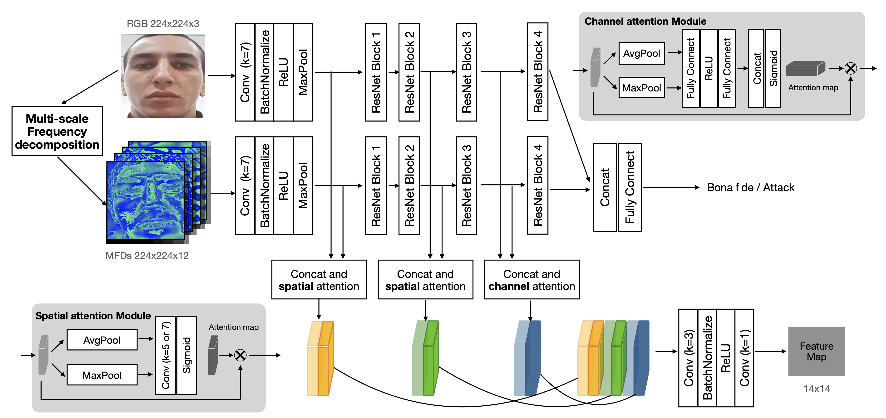

# LMFD-PAD
---
## Note
This is the official repository of the paper: LMFD-PAD: Learnable Multi-level Frequency Decomposition and Hierarchical Attention Mechanism for Generalized Face Presentation Attack Detection. The paper can be found in [here](link).

## Pipeline Overview


## Data preparation
Since the data in all used PAD datasets in our work are videos, we sample 10 frames in the average time interval of each video. In addition, the ratio of bona fide and attack is balanced by simple duplication. Finally, CSV files are generated for further training and evaluation. The format of the dataset CSV file is:
```
image_path,label
/image_dir/image_file_1.png, bonafide
/image_dir/image_file_2.png, bonafide
/image_dir/image_file_3.png, attack
/image_dir/image_file_4.png, attack
```
## Training
The training code for inter-dataset and cross-dataset experiments is same, the difference code between inter_db_main.py and cross_db_main.py is evaluation metrics.
1. Example of inter-dataset training and testing:
    ```
    python inter_db_main.py \
      --protocol_dir 'dir_containing_csv_files' \
      --backbone resnet50 \
      --pretrain True \
      --lr 0.001 \
      --batch_size 64 \
      --prefix 'custom_note' \
    ```
2. Example of cross-dataset training and testing is similar:
    ```
    python cross_db_main.py \
      --protocol_dir 'dir_containing_csv_files' \
      --backbone resnet50 \
      --pretrain True \
      --lr 0.001 \
      --batch_size 64 \
      --prefix 'custom_note' \
    ```

## Results
The results of cross-dataset evaluation under different experimental settings on four face PAD datasets. More details can be found in paper.

